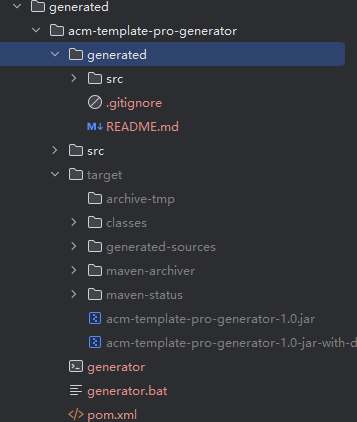
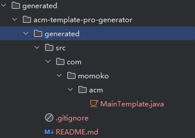

# 🚀 GenShare-Maker


> 一个基于 FreeMarker 模板引擎的代码生成器框架，能够根据模板文件和元数据配置自动生成完整的 Java 项目代码。

## ✨ 功能特性

- 🎯 **模板驱动**：基于 FreeMarker 模板引擎，支持灵活的代码模板定制
- 🔧 **命令行工具**：提供完整的 CLI 工具，支持多种生成命令
- 📦 **一键打包**：自动生成可执行 JAR 包和脚本文件
- 🎨 **高度可配置**：通过 meta.json 配置文件灵活定制生成内容
- 🚀 **快速生成**：一键生成完整的 Java 项目结构

## 🛠️ 技术栈

| 技术 | 版本 | 用途 |
|------|------|------|
| Java | 8+ | 核心开发语言 |
| Maven | 3.6+ | 项目管理和构建 |
| FreeMarker | 2.3.32 | 模板引擎 |
| Picocli | 4.7.5 | 命令行接口框架 |
| Hutool | 5.8.37 | Java 工具库 |
| Lombok | 1.18.30 | 简化 Java 代码 |

## 📦 快速开始

### 前置要求

- JDK 8 或更高版本
- Maven 3.6 或更高版本

### 安装和运行

1. **克隆项目**
   ```bash
   git clone <repository-url>
   cd GenShare-maker
   ```

2. **构建项目**
   ```bash
   mvn clean package
   ```

3. **运行主生成器**
   ```bash
   # 方式一：直接运行 Java 类
   java -cp target/classes com.momoko.maker.generator.main.MainGenerator
   
   # 方式二：运行打包后的 JAR
   java -jar target/Genshare-maker-1.0-SNAPSHOT-jar-with-dependencies.jar
   ```

## 🎯 使用方法

### 生成器使用

运行主生成器会在 `generated` 目录下生成完整的项目代码：

```bash
# 进入生成的项目目录
cd generated/acm-template/pro/generator/target

# 使用生成的命令行工具
.\generator generate -a -l -o
```

### 命令行参数

| 参数 | 说明 |
|------|------|
| `-a` | 作者相关配置 |
| `-l` | 生成循环代码 |
| `-o` | 输出相关配置 |

### 示例截图

**运行主生成器：**



**生成结果：**



## 📁 项目结构

```
GenShare-maker/
├── src/main/java/com/momoko/
│   ├── Main.java                    # 主入口类
│   └── maker/
│       ├── cli/                     # 命令行接口
│       │   ├── CommandExecutor.java # 命令执行器
│       │   ├── command/             # 各种命令实现
│       │   ├── example/             # 示例代码
│       │   └── pattern/             # 设计模式相关
│       ├── generator/               # 代码生成器
│       │   ├── file/                # 文件生成器
│       │   ├── main/                # 主生成器
│       │   ├── JarGenerator.java    # JAR 包生成器
│       │   └── ScriptGenerator.java # 脚本生成器
│       ├── meta/                    # 元数据管理
│       └── model/                   # 数据模型
├── src/main/resources/              # 资源文件
├── generated/                       # 生成的代码输出目录
├── target/                          # Maven 构建输出
└── pom.xml                         # Maven 配置文件
```

## 🔧 配置说明

项目使用 `meta.json` 文件进行配置，支持以下配置项：

- **name**: 项目名称
- **version**: 项目版本
- **basePackage**: 基础包名
- **description**: 项目描述
- **fileConfig**: 文件配置
- **modelConfig**: 模型配置

## 🤝 贡献指南

1. Fork 本仓库
2. 创建您的特性分支 (`git checkout -b feature/AmazingFeature`)
3. 提交您的更改 (`git commit -m 'Add some AmazingFeature'`)
4. 推送到分支 (`git push origin feature/AmazingFeature`)
5. 打开一个 Pull Request

## 📝 许可证

本项目采用 MIT 许可证 - 查看 [LICENSE](LICENSE) 文件了解详情。

## 📞 联系方式

如有问题或建议，请提交 Issue 或联系维护者。

---

⭐ 如果这个项目对您有帮助，请给它一个星标！